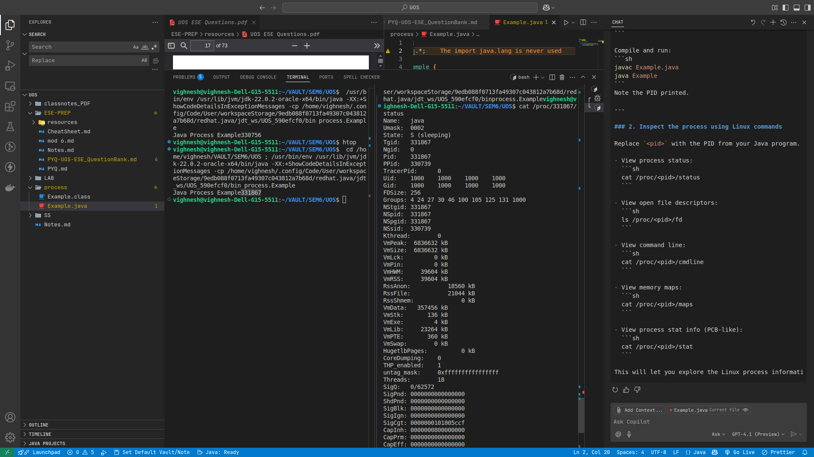
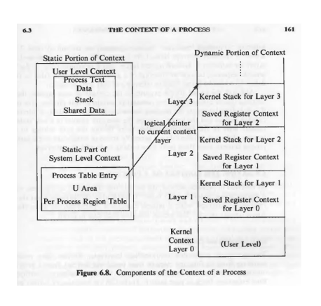
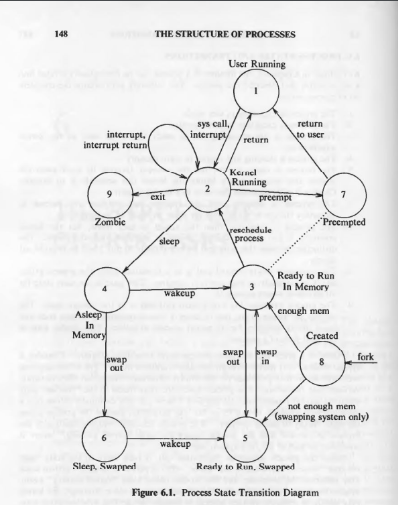

### MOD 5
## 5) Which are the only two processes that exist throughout the lifetime of the system?

**Answer:**
1. **Process 0 (swapper)**  
   - The very first process created by the kernel during system boot.
   - Responsible for memory management tasks.

2. **Process 1 (init/systemd)**  
   - The first user-level process started by the kernel.
   - Responsible for starting and managing system services and user processes.
## 6) Which kernel data structures describe the state of a process?

**Answer:**

The state of a process in the kernel is described by two main data structures:

1. **Process Table Entry (Process Control Block - PCB):**
   - Stores all essential information about a process needed by the kernel at all times.
   - Includes: process state, process ID, CPU registers, program counter, memory management info, scheduling info, and accounting info.
   - **Significance:**  
     - Allows the kernel to keep track of all processes, manage scheduling, and perform context switching.
     - Without the PCB, the kernel would not know which processes exist, their states, or how to resume them after a context switch.

2. **User Area (U-area):**
   - Contains process-specific information needed only when the process is running.
   - Includes: user stack, open file descriptors, user credentials, and other process-specific kernel data.
   - **Significance:**  
     - Keeps user-level and process-specific kernel data separate from global kernel data.
     - Swapped in/out with the process, saving memory when the process is not running.
     - Without the U-area, process-specific data would have to be stored in the PCB or globally, leading to inefficiency and security issues.

**Why are both needed? What problems do they solve?**

- **Separation of Concerns:**  
  The PCB holds minimal, always-needed info for process management and scheduling, while the U-area holds bulkier, process-specific info only needed during execution. This separation optimizes memory usage and system performance.

- **Efficient Context Switching:**  
  When switching between processes, the kernel saves/restores the PCB to keep track of process state, and swaps the U-area as needed. This allows fast and reliable multitasking.

- **Security and Isolation:**  
  The U-area ensures that sensitive process-specific data is only accessible when the process is running, improving security and process isolation.

**Summary:**  
These structures are fundamental for multitasking operating systems. They allow the kernel to manage multiple processes efficiently, securely, and reliably. Without them, process management would be chaotic, inefficient, and error-prone.

**Uarea output** 

    ## Difference in Output of U-area and PCB in Linux

**PCB (Process Control Block) in Linux:**
- Represented by the `task_struct` in the kernel.
- Contains essential process information needed at all times:
  - Process ID, state, scheduling info, CPU registers, memory pointers, parent/child relationships, etc.
- In Linux, you can see much of this info in `/proc/<pid>/stat` and `/proc/<pid>/status`.

**U-area (User Area) in Linux:**
- The traditional U-area (from older UNIX) held process-specific data needed only during execution, like user stack, open file descriptors, and user credentials.
- In modern Linux, this information is distributed:
  - **Open file descriptors:** `/proc/<pid>/fd/`
  - **User stack and memory maps:** `/proc/<pid>/maps`
  - **User credentials:** `/proc/<pid>/status` (fields like Uid, Gid)
  - **Other process-specific data:** `/proc/<pid>/` subfiles

**Summary Table:**

| Aspect                | PCB (`task_struct`) Output         | U-area Output (Linux equivalent)         |
|-----------------------|------------------------------------|------------------------------------------|
| Location              | `/proc/<pid>/stat`, `/status`      | `/proc/<pid>/fd/`, `/maps`, `/status`    |
| Contains              | PID, state, scheduling, memory info| Open files, stack, credentials, limits   |
| Needed by             | Kernel (always)                    | Kernel (when process is running)         |
| Example command       | `cat /proc/<pid>/status`           | `ls /proc/<pid>/fd`                      |

**Key Point:**  
- PCB info is always needed by the kernel for process management and is mostly static.
- U-area info is bulkier, process-specific, and only needed when the process is running; in Linux, it's split across several `/proc/<pid>/` files.
## 7) Why are various fields of the u-area required to access during process execution?


**Answer:**

The **u-area (user area)** is a crucial data structure in traditional UNIX systems that stores process-specific information needed during execution. Access to its various fields is essential for the following reasons:

1. **Process Control and State Management:**
   - The u-area holds key process identifiers (PID, parent PID), user and group IDs, and execution state.
   - The OS uses this information to manage, schedule, and switch between processes.

2. **File Descriptor Table:**
   - Contains a table of all files and devices opened by the process.
   - Required for the process to perform I/O operations (read/write files, communicate via sockets, etc.).
   - Ensures each process has isolated access to its own set of open files.

3. **Signal Handling:**
   - Stores signal handlers, pending signals, and related data.
   - Allows the process to respond to asynchronous events (like interrupts or termination requests) from the OS or other processes.

4. **Memory Management:**
   - Includes pointers and limits for the process’s stack, heap, and program break.
   - Enables dynamic memory allocation and safe stack operations during execution.

5. **User Stack and Kernel Stack:**
   - The u-area contains the user stack, which is used for function calls, local variables, and context during execution.
   - Essential for maintaining the process’s execution context and supporting system calls.

6. **Environment Variables:**
   - Holds environment variables (like PATH, HOME, etc.) that define the process’s runtime environment.
   - Needed for the process to interact with the system and adapt its behavior.

7. **Accounting and Resource Usage:**
   - Tracks CPU usage, memory consumption, and other resource statistics.
   - Used for system monitoring, process accounting, and enforcing resource limits.

**Summary:**  
The fields in the u-area are accessed during process execution to provide all the necessary context, resources, and control mechanisms. Without these fields, the OS could not efficiently manage processes, handle I/O, signals, or memory, nor provide security and isolation between processes.
## 8) What are the system calls that support the processing environment in the kernel? How does the kernel use system calls for processing?


**Answer:**

System calls are the primary interface between user-level processes and the kernel. They allow user programs to request services and resources managed by the operating system. The kernel uses system calls to ensure secure, controlled, and efficient access to hardware and system resources.

#### Common System Calls Supporting the Processing Environment:

1. **Process Control:**
   - `fork()`: Creates a new process by duplicating the calling process.
   - `exec()`: Loads a new program into the current process, replacing its memory space.
   - `exit()`: Terminates the calling process and releases its resources.
   - `wait()`: Waits for a child process to terminate.

2. **File Management:**
   - `open()`: Opens a file and returns a file descriptor.
   - `read()`: Reads data from a file.
   - `write()`: Writes data to a file.
   - `close()`: Closes an open file descriptor.
   - `lseek()`: Moves the file pointer to a specific location.

3. **Memory Management:**
   - `brk()`: Changes the end of the data segment (heap).
   - `mmap()`: Maps files or devices into memory.
   - `munmap()`: Unmaps previously mapped memory regions.
   - `sbrk()`: Increases or decreases the program's data space.

4. **Interprocess Communication (IPC):**
   - `pipe()`: Creates a unidirectional data channel for communication between processes.
   - `shmget()`, `shmat()`, `shmdt()`: Allocate, attach, and detach shared memory segments.
   - `msgget()`, `msgsnd()`, `msgrcv()`: Message queue operations.
   - `semget()`, `semop()`, `semctl()`: Semaphore operations.

5. **Signal Handling:**
   - `signal()`: Sets a signal handler for a specific signal.
   - `kill()`: Sends a signal to a process.
   - `sigaction()`: Examines or changes the action associated with a signal.

6. **Device Management:**
   - `ioctl()`: Device-specific input/output operations.
   - `read()`, `write()`: Also used for device I/O.

7. **Information Maintenance:**
   - `getpid()`: Gets the process ID.
   - `getppid()`: Gets the parent process ID.
   - `getuid()`, `geteuid()`: Gets the user and effective user IDs.

---

#### **How the Kernel Uses System Calls:**

- **Transition from User Mode to Kernel Mode:**  
  When a process invokes a system call, the CPU switches from user mode to kernel mode, allowing the kernel to execute privileged operations.

- **Parameter Validation and Security:**  
  The kernel checks the validity of parameters passed by the user process to prevent illegal access or security breaches.

- **Resource Management:**  
  The kernel allocates, manages, and releases resources (memory, files, devices) as requested by system calls.

- **Controlled Access:**  
  System calls provide a controlled gateway for user processes to access hardware and critical OS services, ensuring stability and security.

- **Return of Results:**  
  After performing the requested operation, the kernel returns the result (success, failure, data) to the calling process.

---

**Summary:**  
System calls are essential for process creation, file and memory management, communication, and device access. They provide a safe and standardized way for user programs to interact with the kernel, ensuring efficient and secure operation of the system.


## 9)What is a pipe? What is a filter? Give examples/applications of pipe and filter.

**Answer:**

#### Pipe:
A **pipe** is a mechanism for inter-process communication (IPC) in Unix-like operating systems. It allows the output of one process to be used directly as the input to another process, creating a communication channel between them. In the shell, a pipe is represented by the `|` symbol.

- **Purpose:** Enables chaining of commands so that the output of one command becomes the input for the next.
- **Example:**  
  ```sh
  cat numbers.txt | grep "even"
  ```
  Here, the output of `cat numbers.txt` is passed as input to `grep "even"`.

#### Filter:
A **filter** is a program or command that takes input data, processes or transforms it, and produces output data. Filters are often used in pipelines to process data step by step.

- **Purpose:** To modify, select, or transform data as it passes through the pipeline.
- **Examples of filters:** `grep`, `sort`, `uniq`, `awk`, `sed`.

#### Example/Application of Pipe and Filter:

Suppose you have a file `numbers.txt` containing a list of numbers and you want to process this data:

- **Using a Pipe:**
  ```sh
  cat numbers.txt | grep "even"
  ```
  - `cat` reads the file and outputs its contents.
  - The pipe `|` sends this output to `grep`, which filters lines containing "even".

- **Using Multiple Filters in a Pipeline:**
  ```sh
  cat numbers.txt | grep "even" | sort | uniq
  ```
  - `cat` outputs the file contents.
  - `grep "even"` filters only even numbers.
  - `sort` arranges them in order.
  - `uniq` removes duplicate entries.

**Applications:**
- Data processing pipelines (e.g., log analysis, text processing).
- Combining simple commands to perform complex tasks without writing new programs.
- Efficiently transforming and filtering data streams in real-time.

**Summary:**  
Pipes connect the output of one process to the input of another, while filters process and transform the data as it flows through the pipeline. Together, they enable powerful and flexible data processing in Unix-like systems.


### MOD 5 -> Structure of Process 
### 1) What are the system-level context of the process: static and dynamic parts?


**Answer:**

The system-level context of a process consists of two main parts: **static** and **dynamic**.

---

#### **Static Part of System-Level Context:**

- **Process Table Entry (PCB):**
  - Contains essential control information about the process (e.g., process state, PID, scheduling info).
  - Always accessible to the kernel throughout the process's lifetime.

- **U-area (User Area):**
  - Holds process-specific control information needed only when the process is running (e.g., user stack, open file descriptors).
  - Some general parameters (like process priority) are stored in the process table for access outside the process context.

- **Region Tables, Pregion Entries, and Page Tables:**
  - Define the mapping from virtual to physical addresses.
  - Describe the text, data, stack, and other memory regions of a process.
  - Shared regions (e.g., shared libraries) are considered part of the context for each process using them.

---

#### **Dynamic Part of System-Level Context:**

- **Kernel Stack:**
  - Each process has its own kernel stack, used for kernel function calls and maintaining execution state during system calls or interrupts.
  - The kernel stack is empty when the process is in user mode.

- **Context Layers (Stack of Contexts):**
  - The dynamic part is visualized as a stack (last-in-first-out) of context layers.
  - Each layer contains information needed to restore the previous state, including register values.
  - The kernel pushes a new context layer on events like interrupts, system calls, or context switches.
  - The kernel pops a context layer when returning from an interrupt, completing a system call, or switching back to user mode.
- **Diagram**
    
---

**Summary:**  
- The **static part** (PCB, u-area, region/page tables) remains constant for the process's lifetime and defines its identity and resources.
- The **dynamic part** (kernel stack, context layers) changes as the process interacts with the kernel, enabling safe handling of interrupts, system calls, and context switches.

### 2)state Transition Diagram:
- **State Transition Diagram**

- The process state transition diagram shows the various states a process can be in and how it transitions between them. Here’s what each numbered state in the diagram represents:

1. **User Running**
   - The process is running in user mode, executing user instructions.

2. **Kernel Running**
   - The process is running in kernel mode, typically executing a system call or handling an interrupt.

3. **Ready to Run, In Memory**
   - The process is loaded in main memory and is ready to be scheduled on the CPU.

4. **Asleep, In Memory**
   - The process is waiting (blocked) for an event (like I/O completion) but remains in main memory.

5. **Ready to Run, Swapped**
   - The process is ready to run but has been swapped out of main memory (resides on disk).

6. **Sleep, Swapped**
   - The process is waiting for an event and is swapped out of main memory.

7. **Preempted**
   - The process was running but was preempted (CPU taken away) and is waiting to be rescheduled.

8. **Created**
   - The process has just been created (e.g., via `fork()`) but is not yet ready to run, possibly due to lack of memory.

9. **Zombie**
   - The process has finished execution but still has an entry in the process table (waiting for the parent to collect its exit status).

---

**Transitions** between these states occur due to events like system calls, interrupts, process creation, process termination, swapping in/out of memory, and scheduling decisions.

**Summary Table:**

| State Number | State Name                | Description                                               |
|--------------|--------------------------|-----------------------------------------------------------|
| 1            | User Running             | Executing user code                                       |
| 2            | Kernel Running           | Executing kernel code (system call/interrupt)             |
| 3            | Ready to Run, In Memory  | Ready for CPU, in memory                                  |
| 4            | Asleep, In Memory        | Waiting for event, in memory                              |
| 5            | Ready to Run, Swapped    | Ready for CPU, swapped out                                |
| 6            | Sleep, Swapped           | Waiting for event, swapped out                            |
| 7            | Preempted                | Preempted from CPU, waiting to be rescheduled             |
| 8            | Created                  | Just created, not yet ready to run                        |
| 9            | Zombie                   | Finished execution, waiting for parent to collect status  |


- ##Questions :
    - Q1: why 3 dosent potint to 1 but 2 a process can become user process before becoming the kernel proc
- Ans: Great question! Here’s why **state 3 (Ready to Run, In Memory)** points to **state 2 (Kernel Running)** and not directly to **state 1 (User Running)**:

- When a process is in the **Ready to Run** state, it is waiting for the CPU. When the scheduler selects it, the process starts running—but always begins in **kernel mode** (state 2).
- This is because the context switch, scheduling, and setup are handled by the kernel. The process must first execute some kernel code (like restoring its context, updating scheduling info, etc.).
- Only after this kernel work is done does the process transition to **user mode** (state 1), where it resumes or starts executing user instructions.

**A process cannot directly become a user process (state 1) from the ready state (state 3) without first passing through kernel mode (state 2)**. The kernel is always in control of process scheduling and state transitions.

**Summary:**  
- **3 → 2:** Scheduler picks the process; kernel prepares it to run.
- **2 → 1:** Kernel switches the process to user mode to execute user code.

This ensures all transitions are managed securely and consistently by the kernel.

### 3) Is the management of regions of a process similar to management of inodes in the kernel? If yes, why is it similar to inode management?

**Answer:**

Yes, the management of regions of a process is similar to the management of inodes in the kernel in several ways:

#### **Similarities:**

1. **Resource Tracking and Organization:**
   - **Inodes:** In a file system, inodes are data structures that store metadata about files (permissions, ownership, size, pointers to data blocks, etc.). The kernel manages inodes to keep track of all files and their properties.
   - **Process Regions:** A process's memory is divided into regions (such as code, stack, heap, shared memory). The OS manages these regions, tracking their addresses, sizes, permissions, and usage.

2. **Metadata Management:**
   - Both inodes and process regions store important metadata. For inodes, this is file-related; for regions, it is memory-related (start address, length, access rights, etc.).

3. **Allocation and Deallocation:**
   - The kernel must efficiently allocate and deallocate both inodes (when files are created/deleted) and memory regions (when processes request/release memory).

4. **Security and Access Control:**
   - Both systems enforce permissions and access controls to ensure only authorized access to files (via inodes) or memory (via region descriptors).

5. **Structured and Reliable Management:**
   - Both use structured data (tables, lists, or trees) to organize and manage resources, ensuring efficient lookup, allocation, and release.

#### **Why is this similarity important?**

- Both inodes and process regions are fundamental OS resources that must be managed efficiently and securely to ensure system stability and performance.
- Effective management of these resources prevents leaks, corruption, and unauthorized access, which are critical for both file systems and process execution.

**Summary:**  
The management of process regions and inodes is similar because both involve structured tracking, metadata management, allocation/deallocation, and access control of essential OS resources. This structured approach is crucial for the reliability and efficiency of the operating system.


### 4) What are the advantages to the kernel in maintaining the U area in the system?

**Answer:**
Kernel gets to know the following info about the **running process**
1.pointer to process tabe 
2.Times(Time spent by process in user and kernel mode)
3.Signal handling array 
4.Real and User Effective IDS 
5.limit
6.Permission field 

Uarea Fields 
    Okay, let's break down the advantages to the kernel for maintaining the U-area (or its conceptual equivalents in modern systems) by focusing on the specific fields you mentioned.

The U-area contains information that the kernel needs to manage a process effectively, especially when the process is running or making system calls.


The kernel gains significant advantages by maintaining the U-area (or analogous structures) because it provides a dedicated space for crucial per-process information. This information helps the kernel manage and control processes efficiently and securely. Here are the key fields typically found and their importance to the kernel:

1.  **Pointer to Process Table Entry:**
    *   **Note:** This field links the U-area back to the main entry for the process in the kernel's process table (often part of the Process Control Block - PCB).
    *   **Advantage to Kernel:** Allows the kernel, when working with the U-area, to quickly access more global, static information about the process (like its PID, state, scheduling priority) stored in the process table. It ensures easy navigation between different pieces of process-related data.

2.  **Real & Effective User IDs (UIDs) and Group IDs (GIDs):**
    *   **Note:** These IDs determine the process's ownership and privileges. The real UID is who owns the process, and the effective UID is what the kernel uses to check permissions for actions like file access.
    *   **Advantage to Kernel:** The kernel uses these IDs to enforce security. When a process tries to access a file or resource, the kernel checks its effective UID/GID against the resource's permissions to decide if the access should be allowed or denied. This is fundamental for system security.

3.  **Timer Fields (Time spent in user mode and kernel mode):**
    *   **Note:** These timers track how much CPU time the process has consumed while executing its own code (user mode) and how much time it has spent executing kernel code on its behalf (kernel mode, e.g., during system calls).
    *   **Advantage to Kernel:** This information is vital for:
        *   **Scheduling:** The scheduler can use this to make decisions (e.g., fair-share scheduling).
        *   **Resource Accounting:** The system can track resource usage for billing or monitoring.
        *   **Profiling:** Helps identify performance bottlenecks.

4.  **Signal Handling Array:**
    *   **Note:** This array specifies how the process wants to handle different signals (e.g., ignore, catch with a specific function, or perform the default action).
    *   **Advantage to Kernel:** When a signal is sent to the process, the kernel consults this array to determine the correct action to take. This allows processes to customize their response to asynchronous events.

5.  **Control Terminal Field:**
    *   **Note:** If the process is associated with a login terminal (like a command-line session), this field identifies that terminal.
    *   **Advantage to Kernel:** Helps the kernel manage input/output redirection and signal delivery related to the terminal (e.g., sending a `Ctrl+C` signal from the terminal to the foreground process).

6.  **Error Field (for System Calls):**
    *   **Note:** When a system call made by the process fails, the kernel places an error code (e.g., `ENOENT` for "No such file or directory") in this field.
    *   **Advantage to Kernel:** This is the standard way for the kernel to communicate the reason for a system call failure back to the user process. The process can then check this error code (often via a global variable like `errno`) to understand what went wrong.

7.  **Return Value Field (for System Calls):**
    *   **Note:** This field holds the result of a successful system call (e.g., a file descriptor from `open()`, or the number of bytes read by `read()`).
    *   **Advantage to Kernel:** Provides the mechanism for the kernel to return data or status information from a system call back to the calling process.

8.  **I/O Parameters:**
    *   **Note:** These include details needed for I/O operations, such as the memory address of the buffer for reading/writing, the number of bytes to transfer, and the current file offset.
    *   **Advantage to Kernel:** When a process makes an I/O system call (like `read` or `write`), the kernel uses these parameters stored in the U-area to perform the actual data transfer to/from the device or file.

9.  **Current Directory & Current Root:**
    *   **Note:**
        *   **Current Directory:** The directory the process is currently "in." Relative pathnames (e.g., `file.txt` instead of `/home/user/file.txt`) are resolved starting from this directory.
        *   **Current Root:** Defines the root of the file system as seen by this process. This is used by `chroot` to create a "jailed" environment.
    *   **Advantage to Kernel:** The kernel uses these to correctly interpret file paths provided by the process. It allows processes to have their own file system context, simplifying path resolution and enabling features like `chroot`.

By maintaining these fields in the U-area, the kernel has quick and organized access to the specific context it needs to manage each process while it's running, making system calls, or interacting with the system.
### 5) When attaching a region to a Process, how can the kernel check that the region does not overlap virtual addresses in regions already attached to the Process?

**Answer:**

When a process requests to attach a new memory region (e.g., via `mmap` or when loading a shared library), the kernel must ensure this new region doesn't overlap with any existing virtual address ranges already allocated to that process. Here's a more detailed breakdown of how the kernel typically performs this check:

1.  **Maintain a List/Tree of Existing Regions:**
    *   **Note:** For each process, the kernel maintains a data structure (often a sorted list, a balanced tree like a red-black tree, or an interval tree) that keeps track of all currently attached memory regions.
    *   Each entry in this structure stores at least:
        *   The **start virtual address** of the region.
        *   The **end virtual address** (or start address and size) of the region.
        *   Other metadata like permissions (read, write, execute).
    *   **Advantage to Kernel:** This organized list allows the kernel to efficiently query and manage the process's virtual address space.

2.  **Define the New Region's Boundaries:**
    *   **Note:** The request to attach a new region will specify a desired start virtual address (or let the kernel choose one) and a size for the new region.
    *   Let the new region be defined by `new_start_addr` and `new_end_addr` (where `new_end_addr = new_start_addr + new_size - 1`).

3.  **Iterate and Compare:**
    *   **Note:** The kernel iterates through the list/tree of the process's existing memory regions.
    *   For each `existing_region` (defined by `existing_start_addr` and `existing_end_addr`):
        *   The kernel checks for overlap. An overlap occurs if the new region and an existing region share any common virtual addresses. This can be checked with the condition:
            `NOT (new_end_addr < existing_start_addr OR new_start_addr > existing_end_addr)`
            In simpler terms, they overlap if:
            *   The new region's start is inside the existing region.
            *   The new region's end is inside the existing region.
            *   The existing region is completely contained within the new region.
            *   The new region is completely contained within the existing region.

4.  **Handle Overlap Detection:**
    *   **Note:** If the comparison in step 3 reveals an overlap with *any* existing region:
        *   The kernel will **reject** the request to attach the new region.
        *   It typically returns an error code to the process (e.g., `EINVAL` or `ENOMEM` if the kernel was trying to find a free spot and couldn't).
    *   **Advantage to Kernel:** This prevents corruption of memory, ensures that different parts of the process (code, data, stack, heap, shared libraries) do not interfere with each other, and maintains the integrity of the process's address space.

5.  **Attach if No Overlap:**
    *   **Note:** If the kernel iterates through all existing regions and finds no overlaps, the new region can be safely attached.
    *   The kernel then updates its list/tree of memory regions for the process to include the newly attached region.

**Efficiency Considerations:**
*   Keeping the list of regions sorted by start address allows for more efficient searching and overlap detection. For instance, the kernel can stop checking once it encounters existing regions whose start addresses are beyond the end address of the new region.
*   Using more advanced data structures like interval trees can optimize these checks, especially when there are many regions.

By performing these checks meticulously, the kernel ensures that each process has a consistent and non-overlapping virtual address space, which is fundamental for stable and secure program execution.

### Which kernel data structures describe the state of a process?

**Answer:**
The state of a process is primarily described by two kernel data structures:
1.  **Process Table Entry (PTE) / Process Control Block (PCB)**
2.  **U Area (User Area)**

### 7) Suppose a process goes to sleep and the system contains no processes ready to run. What happens when the sleeping process does its context switch?

**Answer:**

When a running process goes to sleep (e.g., waiting for I/O) and its context switch occurs, the kernel needs to decide which process to run next. If there are no other user processes in the "Ready to Run" state:

1.  **Context Switch to Idle Process:**
    *   **Note:** The kernel will typically switch the CPU context to a special, low-priority **idle process** (sometimes called a "swapper process" in older contexts, though its role here is just to keep the CPU busy, or a "scheduler loop").
    *   **What the Idle Process Does:** This idle process doesn't perform any useful user work. Its primary job is to loop, consuming minimal CPU resources, essentially waiting for an event that makes another process ready to run. It might also perform some low-priority system housekeeping tasks.

2.  **CPU Remains Utilized (Nominally):**
    *   **Note:** The CPU is not halted. The idle process keeps the CPU executing instructions. This ensures the system remains responsive to interrupts.
    *   **Advantage to Kernel:** This allows the system to immediately react when an interrupt occurs (e.g., I/O completion for the sleeping process, or a new process being created) that might make a process ready to run.

3.  **Waiting for an Event:**
    *   **Note:** The system remains in this state (CPU executing the idle process) until an interrupt or some other kernel event makes one or more processes transition to the "Ready to Run" state.
    *   **Examples of such events:**
        *   An I/O operation completes, waking up the process that was sleeping on it.
        *   A timer interrupt occurs, and the scheduler decides to wake a periodic task.
        *   A new process is created and becomes ready.

4.  **Next Context Switch:**
    *   **Note:** Once a process becomes "Ready to Run," the kernel (often triggered by the interrupt handler that made the process ready) will schedule this new ready process.
    *   A context switch will then occur from the idle process to the newly ready process.

**In summary:** If a process sleeps and no other processes are ready, the kernel context switches to a special idle process. This idle process keeps the CPU nominally busy and allows the system to wait for an event (like an interrupt) that will make another process ready to run, at which point a context switch to that new process will occur. This ensures the system doesn't halt and can respond to future events.

### 8) What are the system calls that support the processing environment in Kernel?

**Answer:**

System calls are the fundamental interface through which user-level processes request services from the operating system kernel. They are essential for managing the processing environment, allowing programs to interact with system resources in a controlled and secure manner. Here are key categories of system calls that support this:

1.  **Process Control:**
    *   **Note:** These system calls manage the lifecycle and execution of processes.
    *   **Examples:**
        *   `fork()`: Creates a new child process, which is a duplicate of the calling (parent) process.
        *   `exec()` (e.g., `execl`, `execv`, `execve`): Replaces the current process's memory space with a new program.
        *   `exit()`: Terminates the calling process and returns its resources to the system. The parent process can retrieve the exit status.
        *   `wait()` (and `waitpid()`): Allows a parent process to pause until one of its child processes terminates or changes state.
        *   `getpid()`: Returns the process ID (PID) of the calling process.
        *   `getppid()`: Returns the PID of the parent of the calling process.
        *   `nice()`: Adjusts the scheduling priority of a process.

2.  **File Management:**
    *   **Note:** These system calls handle operations on files and directories.
    *   **Examples:**
        *   `open()`: Opens an existing file or creates a new file, returning a file descriptor (a small integer used to refer to the file).
        *   `read()`: Reads data from an open file descriptor into a buffer in the process's memory.
        *   `write()`: Writes data from a buffer in the process's memory to an open file descriptor.
        *   `close()`: Closes an open file descriptor, releasing it for reuse.
        *   `lseek()`: Changes the current read/write position within a file.
        *   `stat()` (and `fstat()`, `lstat()`): Retrieves metadata about a file (e.g., size, permissions, timestamps).
        *   `mkdir()`: Creates a new directory.
        *   `rmdir()`: Removes an empty directory.
        *   `unlink()`: Deletes a name from the file system. If that name was the last link to a file and no process has the file open, the file itself is deleted.

3.  **Memory Management:**
    *   **Note:** These system calls allow processes to manage their virtual address space.
    *   **Examples:**
        *   `brk()` (and `sbrk()`): Changes the location of the program break, which defines the end of the process's data segment (heap), effectively allocating or deallocating memory from the heap.
        *   `mmap()`: Maps files or devices into the process's address space, or creates anonymous memory regions. This is a versatile call for memory allocation and shared memory.
        *   `munmap()`: Unmaps a previously mapped memory region, releasing it.
        *   `mprotect()`: Changes the access protections (read, write, execute) for a region of memory.

4.  **Interprocess Communication (IPC):**
    *   **Note:** These system calls enable different processes to communicate and synchronize with each other.
    *   **Examples:**
        *   `pipe()`: Creates a unidirectional data channel (a pipe) that can be used for communication between related processes (typically parent and child).
        *   Shared Memory (`shmget()`, `shmat()`, `shmdt()`, `shmctl()`): Allows multiple processes to share a common region of memory for fast data exchange.
        *   Message Queues (`msgget()`, `msgsnd()`, `msgrcv()`, `msgctl()`): Allows processes to send and receive messages via kernel-managed queues.
        *   Semaphores (`semget()`, `semop()`, `semctl()`): Provide mechanisms for process synchronization to control access to shared resources.

5.  **Signal Handling:**
    *   **Note:** These system calls manage asynchronous notifications (signals) sent to processes.
    *   **Examples:**
        *   `signal()` (older) or `sigaction()` (preferred): Sets the action a process will take upon receiving a specific signal (e.g., ignore it, execute a custom handler function, or perform the default action).
        *   `kill()`: Sends a signal to a specified process or group of processes.
        *   `alarm()`: Arranges for a `SIGALRM` signal to be sent to the process after a specified number of seconds.
        *   `pause()`: Suspends the process until a signal is caught.

6.  **Device Management & Information:**
    *   **Note:** These system calls allow interaction with hardware devices and retrieval of system information.
    *   **Examples:**
        *   `ioctl()`: Performs device-specific input/output control operations.
        *   `time()`: Gets the current calendar time.
        *   `gettimeofday()`: Gets the current time with higher precision.
        *   `uname()`: Gets system information (OS name, version, hardware type).

#### How the Kernel Uses System Calls for Processing:

The kernel relies on system calls to provide a controlled and secure environment for processes:
*   **Interface & Abstraction:** System calls serve as a well-defined API between user space and the kernel, abstracting hardware complexities.
*   **Mode Transition:** When a process makes a system call, it triggers a software interrupt (trap), causing the CPU to switch from **user mode** to **kernel mode**. This transition is crucial because kernel operations require higher privileges.
*   **Parameter Validation:** In kernel mode, the kernel first validates the parameters passed by the user process to ensure they are valid and won't cause harm or security breaches.
*   **Service Execution:** The kernel then executes the requested service. This might involve interacting with device drivers, manipulating kernel data structures (like process tables or file tables), or managing hardware resources.
*   **Resource Management:** Through system calls, the kernel manages all critical system resources, such as CPU time, memory, files, and I/O devices, allocating them to processes as needed and ensuring fair and secure access.
*   **Return to User Mode:** Once the system call is completed, the kernel prepares a return value (and an error code if applicable), switches the CPU back to user mode, and returns control to the calling process, which resumes its execution.

By channeling all requests for privileged operations through system calls, the kernel maintains system integrity, security, and stability.

### 9) Which four circumstances under which the kernel permits a Context Switch?

**Answer:**

A context switch is the process by which the kernel saves the state of the currently running process and loads the saved state of another process, allowing the CPU to switch from executing one process to another. The kernel permits a context switch under several circumstances. The more precise and kernel-centric circumstances are:

1.  **When a Process Voluntarily Relinquishes the CPU (Sleeps or Waits):**
    *   **Note:** A process might voluntarily give up the CPU because it needs to wait for an event to occur.
    *   **Examples:**
        *   The process makes a system call that causes it to block (e.g., `read()` on a pipe with no data, `wait()` for a child process to terminate, or explicitly calling `sleep()`).
        *   The process is waiting for an I/O operation to complete.
    *   **Kernel Action:** The kernel marks the process as "sleeping" or "blocked" and then performs a context switch to run another ready process (or the idle process if none are ready).

2.  **When a Process Exits:**
    *   **Note:** When a process finishes its execution or is terminated (e.g., by calling `exit()` or due to an unhandled fatal signal).
    *   **Kernel Action:** The kernel reclaims the resources used by the exiting process. Since the process can no longer run, the kernel must perform a context switch to select another ready process to execute.

3.  **When a Process Returns from a System Call to User Mode but is Not the Most Eligible Process to Run:**
    *   **Note:** After a system call completes, the kernel prepares to return control to the process in user mode. However, during the time the process was in the kernel (executing the system call), the state of the system might have changed.
    *   **Circumstances:**
        *   A higher-priority process might have become ready to run.
        *   The current process's time slice might have effectively expired due to the time spent in the kernel.
    *   **Kernel Action:** Before returning to user mode, the scheduler is invoked. If it determines that another process is now more eligible to run (e.g., higher priority, or due to preemption policies), the kernel will perform a context switch to that more eligible process instead of immediately returning to the original process.

4.  **When a Process Returns from an Interrupt Handler to User Mode but is Not the Most Eligible Process to Run:**
    *   **Note:** Similar to returning from a system call, when an interrupt (e.g., a timer interrupt, I/O completion interrupt) has been handled, the kernel is about to return control to the interrupted process in user mode.
    *   **Circumstances:**
        *   The interrupt handling might have made a higher-priority process ready (e.g., I/O completion for a high-priority blocked process).
        *   A timer interrupt might indicate that the current process's time slice has expired (in a preemptive multitasking system).
    *   **Kernel Action:** The scheduler is typically invoked at the end of interrupt handling. If a different process is now deemed more eligible to run, the kernel performs a context switch to that process. If the currently running process is still the most eligible, it resumes execution.

**General Triggers (often leading to the above kernel-level decisions):**

*   **Time Slice Expiration (Preemption):** In preemptive multitasking, a timer interrupt signals the kernel that the current process has used up its allocated time slice. The kernel then context switches to another ready process. (This falls under point 4 above).
*   **Higher-Priority Process Becomes Ready:** If a process with a higher priority than the currently running process becomes ready (e.g., wakes up from sleep), a preemptive scheduler will often context switch to the higher-priority process. (This can lead to points 3 or 4).

These four specific kernel decision points ensure that the CPU is utilized efficiently and that scheduling policies (like priority and preemption) are correctly enforced.

### MOD 6
### 1) Whether signal handling is optional to a process, if yes/no justify? Which system call is used to make it optional?

**Answer:**

Yes, signal handling is **optional** for a process. A process is not required to define custom behavior for every possible signal.

**Justification:**

1.  **Default Actions:**
    *   **Note:** For every signal, the kernel has a predefined default action. For many signals (like `SIGSEGV` - segmentation fault, or `SIGINT` - interrupt from keyboard), the default action is to terminate the process. For others, the default might be to ignore the signal (e.g., `SIGCHLD` by default in some systems, though its default is often more complex) or stop/continue the process.
    *   **Why it makes handling optional:** If a process doesn't specify how to handle a particular signal, the kernel will simply execute this default action. The process doesn't need to write any code for this.

2.  **Explicitly Ignoring Signals:**
    *   **Note:** A process can choose to explicitly ignore most signals. If a signal is ignored, its delivery has no effect on the process.
    *   **Why it makes handling optional:** This is a conscious choice by the process *not* to handle the signal in a custom way, nor to let the default (often termination) occur.

3.  **Providing Custom Handlers:**
    *   **Note:** A process can choose to "catch" a signal by providing a custom function (a signal handler) that will be executed when the signal is delivered.
    *   **Why it makes handling optional:** This is an active choice to override the default behavior or the ignore setting. If the process doesn't do this, it's opting for one of the other two behaviors.

In essence, a process has three main ways it can react to a signal, and only one of them involves writing a custom handler function:
*   **Terminate (Default for many signals):** The process exits. This happens if no other action is specified.
*   **Ignore:** The process continues as if nothing happened.
*   **Catch (Execute a custom function):** The process temporarily suspends its current execution, runs the designated signal handler function, and then typically resumes.

**System Calls to Manage Signal Handling (Making it Optional/Customizable):**

The primary system calls used to specify how a process should handle signals (and thus make the handling optional or customized) are:

1.  **`signal()` (Older, simpler interface):**
    *   **Note:** `old_handler = signal(int signum, sighandler_t handler);`
    *   `signum`: The number of the signal for which the action is being specified.
    *   `handler`: Can be:
        *   `SIG_DFL` (or 0 in some older contexts): Specifies the **default action** for the signal. If a process sets this, it's opting for the kernel's default behavior.
        *   `SIG_IGN` (or 1 in some older contexts): Specifies that the signal should be **ignored**.
        *   **Address of a user-defined function:** Specifies a custom signal handler function to be executed when the signal `signum` is received.
    *   **How it makes handling optional:** A process can use `signal(signum, SIG_DFL)` to revert to default behavior or `signal(signum, SIG_IGN)` to ignore it, neither of which requires writing a custom handler for that specific signal. Only providing a function address means custom handling.
    *   **Kernel Storage:** The kernel typically stores the specified action (default, ignore, or function address) in a per-process data structure, often an array in the U-area, indexed by the signal number.

2.  **`sigaction()` (More modern, robust, and POSIX-preferred interface):**
    *   **Note:** `int sigaction(int signum, const struct sigaction *act, struct sigaction *oldact);`
    *   This system call provides more fine-grained control over signal handling semantics (e.g., blocking other signals during handler execution, restarting system calls).
    *   The `struct sigaction` structure allows specifying `SIG_DFL`, `SIG_IGN`, or a handler function, similar to `signal()`, but with more options.
    *   **How it makes handling optional:** Like `signal()`, `sigaction()` allows setting the disposition to default or ignore, making custom handling optional.

**In summary:** Signal handling is optional because processes can rely on default kernel actions, explicitly ignore signals, or provide custom handlers. The `signal()` and `sigaction()` system calls are used to set these dispositions, allowing a process to choose whether and how it responds to specific signals.
#### Deeper Dive: Understanding `signal()` System Call Parameters

The `signal()` system call allows a process to specify the action to be taken upon receiving a particular signal. Its basic syntax is `signal(int signum, sighandler_t handler);`. Let's break down the parameters:

1.  **`signum` (Signal Number):**
    *   **What it is:** An integer that uniquely identifies a specific signal (e.g., `SIGINT` for interrupt, `SIGSEGV` for segmentation fault).
    *   **Purpose:** It tells the `signal()` system call *which* signal's behavior the process wants to define or change.

2.  **`handler` (The Action to Take):**
    *   This parameter specifies what the kernel should do when the signal `signum` is delivered to the process. It can be one of the following:
        *   **a) Address of a User-Defined Function (Custom Signal Handler):**
            *   **What it is:** The memory address of a function written by the programmer. This function will be executed when the signal occurs.
            *   **Kernel Action:** Upon signal delivery, the kernel temporarily suspends the process's main execution, runs this custom handler function, and then typically resumes the process.
            *   **Example:** `signal(SIGINT, my_custom_interrupt_handler);`
        *   **b) `SIG_IGN` (Signal Ignore):**
            *   **What it is:** A special predefined constant (often `(void (*)(int))1`).
            *   **Kernel Action:** If the signal `signum` arrives, the kernel will simply ignore it. The process continues as if nothing happened. (Note: Some signals like `SIGKILL` and `SIGSTOP` cannot be ignored).
            *   **Example:** `signal(SIGHUP, SIG_IGN);` // Ignore the hangup signal.
        *   **c) `SIG_DFL` (Signal Default):**
            *   **What it is:** A special predefined constant (often `(void (*)(int))0`).
            *   **Kernel Action:** If the signal `signum` arrives, the kernel will perform its predefined default action for that signal. Default actions vary:
                *   Terminate the process (common for `SIGINT`, `SIGTERM`, `SIGSEGV`).
                *   Ignore the signal.
                *   Stop the process (e.g., `SIGTSTP`).
                *   Continue a stopped process.
            *   **Example:** `signal(SIGINT, SIG_DFL);` // Restore default behavior for SIGINT (usually termination).

3.  **Kernel's Internal Storage (e.g., U-area Signal Handler Array):**
    *   **Concept:** For each process, the kernel maintains an internal data structure (conceptually an array or list, historically part of the "u-area"). This structure has an entry for each possible signal number.
    *   **How it's used:** When `signal(signum, handler_action)` is called, the kernel updates the entry corresponding to `signum` in this per-process structure with the specified `handler_action` (`SIG_DFL`, `SIG_IGN`, or the address of the custom function).
    *   When a signal is later delivered to the process, the kernel consults this stored action for that specific signal to determine how to proceed.

**Simple Analogy:**

Think of the kernel's signal handling array for your process as a list of "emergency procedures":
*   `signum` is the type of emergency (e.g., "fire," "intruder," "power outage").
*   `handler` is the instruction for that emergency:
    *   Custom function: "Execute specific plan 'Alpha'."
    *   `SIG_IGN`: "Ignore it, carry on."
    *   `SIG_DFL`: "Follow the building's standard default procedure."

The `signal()` system call is how your process tells the kernel to update these instructions.

### 2) What information does `wait` find when the child process invokes `exit` without a parameter? That is, the child process calls `exit()` instead of `exit(n)`.

**Answer:**

When a child process calls `exit()` without an explicit integer argument (e.g., `exit()` instead of `exit(status_code)`), the C standard library typically ensures that a default exit status is passed to the underlying `_exit()` system call.

**Information Retrieved by `wait()` (or `waitpid()`):**

1.  **Default Exit Status (Typically Success):**
    *   **Note:** If a child process calls `exit()` without an argument, or if `main()` returns without an explicit `return` value (or `return 0;`), the convention is that the process terminates with a status indicating **success**. This is usually an exit status of **0**.
    *   **Kernel Action:** The kernel stores this exit status (0) as part of the child process's termination information (e.g., in its process table entry, which becomes a zombie entry).
    *   **`wait()` Retrieval:** When the parent process calls `wait()` or `waitpid()`, it can retrieve this exit status. The status is encoded in an integer value. Macros like `WIFEXITED(status)` and `WEXITSTATUS(status)` are used to check if the child exited normally and to extract the actual 8-bit exit status code. In this case, `WIFEXITED()` would be true, and `WEXITSTATUS()` would return 0.

2.  **Indication of Normal Termination:**
    *   **Note:** The `wait()` system call also informs the parent *how* the child terminated.
    *   **Kernel Action:** The kernel records that the child process terminated normally (i.e., by calling `exit()` or returning from `main()`), as opposed to being terminated by an unhandled signal.
    *   **`wait()` Retrieval:** The parent can use the `WIFEXITED(status)` macro on the status value returned by `wait()`. If `WIFEXITED(status)` is true, it means the child terminated normally.

**Contrast with Termination by Signal:**

*   If the child process is terminated by a signal (e.g., `SIGSEGV` due to a segmentation fault, or `SIGKILL`), the information retrieved by `wait()` would be different:
    *   `WIFEXITED(status)` would be false.
    *   `WIFSIGNALED(status)` would be true.
    *   `WTERMSIG(status)` would return the number of the signal that caused the child to terminate.

**In Summary:**

When a child calls `exit()` without a parameter:
*   The child process effectively exits with a status code of **0 (success)**.
*   The parent process, upon calling `wait()` or `waitpid()`:
    *   Will receive a status indicating that the child **terminated normally** (checked via `WIFEXITED()`).
    *   Can extract the exit status, which will be **0** (checked via `WEXITSTATUS()`).
### 3) State Process Diagram 
     Draw the nine state diagram and show when the signals are handled and 
checked? Why are signals handled and checked on those transitions only? 
Ans:   
   
 'Reasoning: 
●  Checking signals at state transitions allows the system to find a safe point to 
interrupt the process without corrupting its state or ongoing operations. 
●  Blocking states are natural points to check for signals because the process is 
waiting and less susceptible to disruption. 
●  Ignoring  signals  while  running  helps  maintain  program  flow  and  avoids 
unexpected behavior.


### 3) State Process Diagram: Signal Handling
Draw the nine-state diagram and show when the signals are handled and checked. Why are signals handled and checked on those transitions only?

**Answer:**

#### Nine-State Process Diagram with Signal Check/Handling Points:

Below is the typical nine-state process diagram. The points where the kernel generally checks for and handles pending signals for a process are primarily when the process is transitioning from kernel mode back to user mode, or when it's about to enter or leave a sleep state.
- **State Transition Diagram**
- 


**Key Points on the Diagram for Signal Checking/Handling:**

*   **Transition from Kernel Running (2) to User Running (1):** This is the most crucial and common point. Before the kernel returns control to the process in user mode (after a system call completes or an interrupt handler finishes), it checks for any pending, unblocked signals.
    *   If a signal is to be caught, the kernel arranges for the user-defined signal handler to be executed in user mode.
    *   If the signal's action is to terminate, the process might transition to Zombie (9).
*   **Transition from Kernel Running (2) to Asleep (4 or 6) (e.g., during a blocking system call):**
    *   If a process is about to enter a sleep state (e.g., waiting for I/O), the kernel checks for signals.
    *   If an unblocked signal is pending and the system call is "interruptible," the system call may return prematurely (often with an `EINTR` error), and the signal is then processed (typically on the way back to user mode).
*   **Wakeup from Sleep (4 or 6) leading to Ready (3 or 5), then eventually to Kernel Running (2) and back to User Running (1):** When a process is awakened (e.g., I/O completes), it moves to a ready state. When it's scheduled again and transitions from Kernel Running back to User Running, signals are checked as described in the first point.
*   **Process Creation (8) leading to Ready/Running:** After a new process is created (e.g., by `fork()`) and is being prepared to run, signals (especially those inherited or sent immediately after creation) would be checked before it first enters user mode.
*   **Process Exit (Kernel Running (2) to Zombie (9)):** During the `exit()` system call processing, most new signals are typically ignored, or their default actions (like termination) are effectively what's happening anyway. The kernel finalizes the process state.

#### Why are signals handled and checked on those transitions primarily?

The reasoning provided is accurate and forms the core of the explanation:

1.  **Safe Points for Interruption (Atomicity and Consistency):**
    *   **Explanation:** The kernel checks for signals at points where the process (and the kernel itself, if operating on behalf of the process) is in a consistent and "safe" state to be interrupted or to have its flow of control altered.
    *   **Transition from Kernel to User Mode:** When returning from a system call or an interrupt, the kernel has completed its privileged operation. This is a natural boundary. Handling a signal here ensures that kernel data structures are not left in an inconsistent state.
    *   **Before Sleeping:** If a process is about to block for a long time, checking for signals allows it to respond to events (like `SIGINT`) rather than being indefinitely stuck, if the sleep is interruptible.

2.  **Efficiency:**
    *   **Explanation:** Constantly checking for signals at every instruction would be computationally very expensive and would severely degrade system performance. Checking at well-defined, less frequent points (like mode transitions or before blocking) is a more efficient approach.

3.  **Maintaining Program Flow and Avoiding Unexpected Behavior:**
    *   **Explanation:** While signals are asynchronous, the kernel tries to deliver them at points that minimize disruption to critical operations, especially within the kernel.
    *   **User Mode vs. Kernel Mode:** Signals are *delivered* to user mode (i.e., a user-defined handler runs in user mode). If a process is in kernel mode when a signal is noted, the kernel will typically wait until it's about to return to user mode to actually "deliver" it by invoking the handler. This prevents a user-level signal handler from running while the process is in the middle of a privileged kernel operation.

4.  **Interruptibility of System Calls:**
    *   **Explanation:** Many blocking system calls are designed to be "interruptible" by signals. When a signal arrives for a process blocked in such a call, the kernel can abort the system call (usually returning `EINTR`) and then arrange for the signal to be handled. This check naturally occurs when the event (the signal) that could interrupt the sleep is processed by the kernel.


### 4) What are the functions (algorithm) carried out by the `exit` system call (process termination)? Why is the `exit` system call designed in the Kernel for process termination?

**Answer:**

The `exit` system call is the standard mechanism by which a process terminates its execution in a controlled manner. When a process calls `exit(status)`, the kernel performs a series of crucial steps to dismantle the process's context and manage its departure.

#### Functions (Algorithm) Carried Out by the `exit` System Call:

The kernel's algorithm for the `exit` system call is comprehensive, ensuring that all resources are properly managed. Here's a breakdown of the typical steps:

1.  **Ignore All Signals:**
    *   **Note:** The process is about to terminate, so further signal handling is generally irrelevant and could complicate the cleanup. The kernel sets the disposition of all signals to be ignored for this process.

2.  **Handle Process Group Leadership (if applicable):**
    *   **Note:** If the exiting process is a process group leader and has an associated controlling terminal:
        *   A `SIGHUP` (hangup) signal is sent to all processes in its foreground process group. This often indicates to these processes that their controlling terminal has been disconnected.
        *   The process group ID for members of the process group might be reset or handled according to system policies.

3.  **Close All Open File Descriptors:**
    *   **Note:** The kernel iterates through the process's file descriptor table and closes each open file.
    *   **Kernel Action:** For each file, this involves:
        *   Decrementing the open count in the system-wide file table entry.
        *   If the count reaches zero, the file table entry is freed.
        *   Decrementing the reference count on the in-memory inode. If this count reaches zero (and no other hard links exist), the inode and associated disk blocks may be freed (depending on the file system).
    *   This prevents resource leaks and ensures data is flushed if buffered.

4.  **Release Current Directory and Changed Root:**
    *   **Note:** The process holds references (like inode pointers) to its current working directory and, if `chroot` was used, its changed root directory.
    *   **Kernel Action:** The kernel releases these references (conceptually, like calling `iput` on the inodes), decrementing their reference counts.

5.  **Release Memory Regions:**
    *   **Note:** All memory regions associated with the process (text, data, stack, heap, shared memory segments, memory-mapped files) must be deallocated or detached.
    *   **Kernel Action (Algorithm: `freereg`):**
        *   For private regions (like the process's own data and stack), the physical memory pages are returned to the system's free memory pool.
        *   For shared memory regions, the process's attachment to the region is removed, and the region's reference count is decremented. If the count drops to zero, the shared memory segment itself might be deallocated.
        *   For memory-mapped files, mappings are unlinked.

6.  **Write Accounting Record:**
    *   **Note:** The kernel often collects statistics about the process's resource usage (CPU time, memory used, I/O operations).
    *   **Kernel Action:** This information is written to an accounting file or system log for administrative or monitoring purposes.

7.  **Transition to Zombie State:**
    *   **Note:** The process is not entirely removed from the system yet. It enters the "zombie" state.
    *   **Kernel Action:** The process's state in its process table entry is marked as `SZOMB` (zombie). Most of its resources are freed, but the process table entry itself is kept. This entry retains minimal information, primarily the process ID, termination status (the `status` argument to `exit`), and resource usage statistics.
    *   **Purpose:** This allows the parent process to retrieve the child's exit status and resource usage information using the `wait()` system call.

8.  **Reparent Child Processes (Orphan Adoption):**
    *   **Note:** If the exiting process has any child processes still running (which are now "orphaned").
    *   **Kernel Action:** These orphaned child processes are "re-parented" – their parent process ID is changed to that of a special system process, typically `init` (process ID 1).
    *   If any of these re-parented children were already in the zombie state, a `SIGCHLD` (death of child) signal is sent to `init` so it can `wait()` for them and clean them up.

9.  **Notify Parent Process:**
    *   **Note:** The parent process needs to be informed that its child has terminated.
    *   **Kernel Action:** A `SIGCHLD` signal is sent to the parent process of the exiting process. This signal prompts the parent to call `wait()` or `waitpid()` to collect the child's exit status and allow the kernel to finally remove the zombie process's table entry.

10. **Perform Context Switch:**
    *   **Note:** The exiting process can no longer execute.
    *   **Kernel Action:** The kernel selects another ready process from the run queue and performs a context switch to that process. If no other processes are ready, it switches to the idle process.

#### Why is the `exit` system call designed in the Kernel?

Designing the `exit` system call to be handled by the kernel is crucial for several fundamental reasons related to operating system integrity, security, and resource management:

1.  **Controlled and Complete Resource Reclamation:**
    *   **Reason:** Processes acquire various system resources (memory, files, IPC objects, etc.). If termination were left to the user process itself, it might fail to release all resources correctly, leading to resource leaks that could degrade system performance or even cause crashes.
    *   **Kernel's Role:** The kernel has a global view of all resources. By managing `exit`, it can systematically and reliably identify and release all resources held by the terminating process, regardless of how well-behaved the process was.

2.  **Maintaining System Consistency and Reliability:**
    *   **Reason:** An orderly shutdown is vital. Incorrect termination could leave shared data structures in an inconsistent state or disrupt other processes.
    *   **Kernel's Role:** The kernel enforces a standard, consistent termination procedure for all processes. This includes updating kernel data structures (like process tables, file tables), ensuring that dependencies are handled correctly (e.g., reparenting orphans), and maintaining the overall stability of the system.

3.  **Inter-Process Communication and Synchronization:**
    *   **Reason:** The termination of a process often needs to be communicated to other related processes, particularly its parent.
    *   **Kernel's Role:** The kernel handles the notification mechanism (e.g., sending `SIGCHLD` to the parent) and manages the synchronization (e.g., the parent `wait()`ing for the child). This ensures that inter-process dependencies related to termination are correctly managed.

4.  **Security and Privilege Enforcement:**
    *   **Reason:** Many resource deallocation tasks and system state updates require privileged operations that user-mode processes cannot perform directly. For instance, modifying system-wide tables or directly manipulating hardware state.
    *   **Kernel's Role:** Process termination is a privileged operation. By handling it in kernel mode, the OS can enforce security policies, ensure that a process only affects its own resources (or those it's permitted to affect), and prevent malicious or buggy processes from destabilizing the system during their exit.

5.  **Handling Involuntary Termination:**
    *   **Reason:** Processes don't always terminate by voluntarily calling `exit()`. They can be terminated by unhandled fatal signals (e.g., segmentation fault, illegal instruction).
    *   **Kernel's Role:** Even in these cases, the kernel invokes a similar cleanup path (often internally calling its `exit` logic) to ensure resources are reclaimed and the system remains stable. If termination were purely a user-space function, such involuntary terminations would be chaotic.

6.  **Atomicity of Critical Operations:**
    *   **Reason:** Certain parts of the termination process need to be atomic (indivisible) to prevent race conditions or inconsistent states, especially when dealing with shared resources or notifying other processes.
    *   **Kernel's Role:** The kernel can ensure atomicity for these critical sections, often by disabling interrupts or using synchronization primitives during sensitive parts of the `exit` procedure.

In essence, placing the `exit` logic within the kernel centralizes control, ensures comprehensive cleanup, maintains system stability and security, and handles the complexities of process lifecycle management that are beyond the capability and privilege level of individual user processes.
